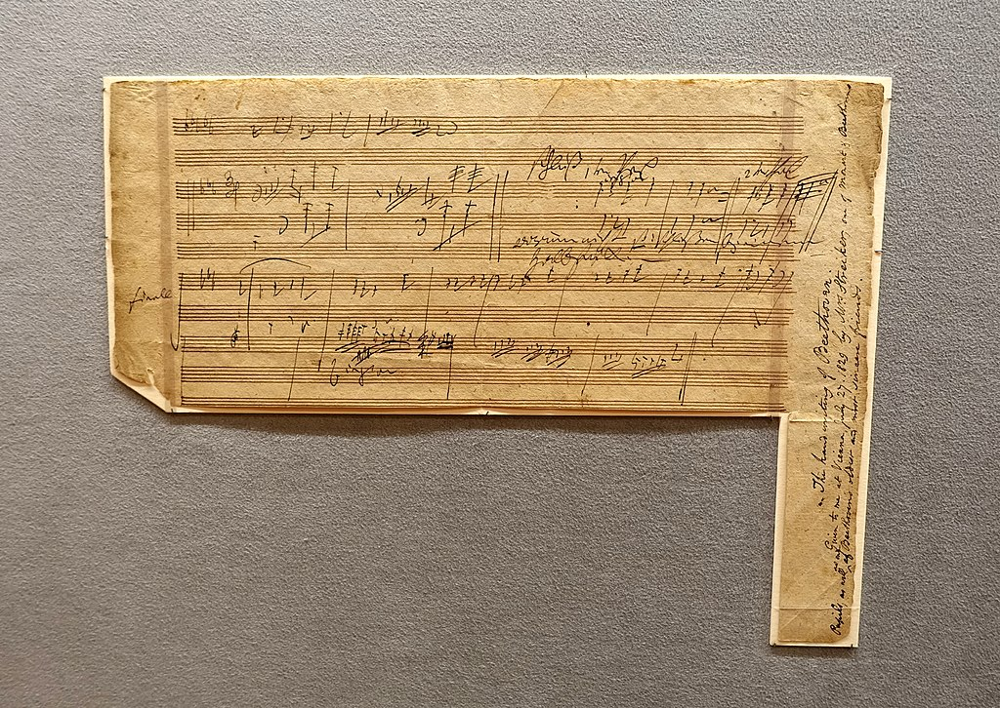

# 槌子键琴大奏鸣曲

《**槌子键琴大奏鸣曲**》（德语：*Große Sonate für das Hammerklavier*），即《**降 B 大调第 29 钢琴奏鸣曲**》，作品 106，是路德维希·范·贝多芬于 1817 年至1818年间创作的钢琴奏鸣曲，献给其赞助人鲁道夫大公。为贝多芬晚期的重要作品之一，它通常被认为是贝多芬在技术上最具挑战性的钢琴作品和古典钢琴曲目中要求最高的独奏作品之一。[^1]

[^1]: [第 29 钢琴奏鸣曲 (贝多芬) - 维基百科，自由的百科全书](https://zh.wikipedia.org/wiki/%E7%AC%AC29%E9%92%A2%E7%90%B4%E5%A5%8F%E9%B8%A3%E6%9B%B2_(%E8%B4%9D%E5%A4%9A%E8%8A%AC))
