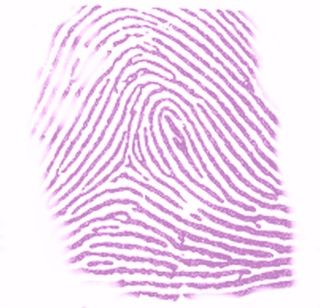

# 茚三酮溶液

氨基酸与茚三酮溶液反应，会产生蓝紫色物质，这被称作茚三酮反应。

茚三酮常用来检测指纹：将茚三酮涂在指纹上，茚三酮会与指纹残留物中的氨基酸发生显色反应。

 [^1]

---

[^1]: [File:Ninhydrin staining thumbprint.png - Wikimedia Commons](https://commons.wikimedia.org/wiki/File:Ninhydrin_staining_thumbprint.png)
