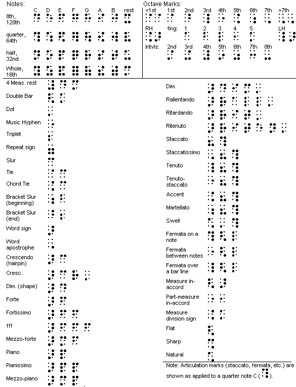
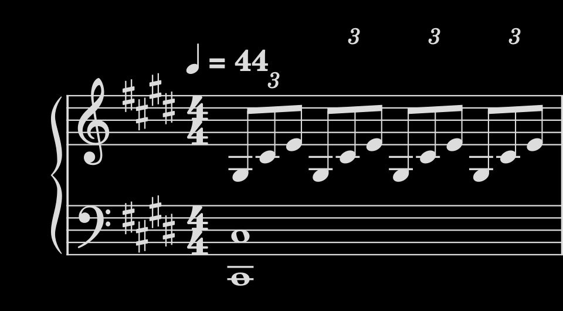

# 盲文乐谱

盲文乐谱也称点字乐谱，视障者可以透过触摸乐谱上的突起来阅读。以下是盲文乐谱摘要表格：

## 月光

> 嘘だ。左手は二つの黒い鍵盤を押さえていたし、右手も一つの黒い鍵盤を押さえていた。明らかに分かっていた。  
> 明显是在说谎。左手放在两个黑键之上，右手也按着一个黑键。很明显是知道怎么阅读的。

这里只埜想演奏的是贝多芬的「C♯ 小调第 14 号钢琴奏鸣曲」（月光奏鸣曲）的第一乐章。「左手两个黑键，右手也按着一个黑键」，对应的是 C♯2、C♯3 和 G♯3，即第一小节第一拍的三个音符。

