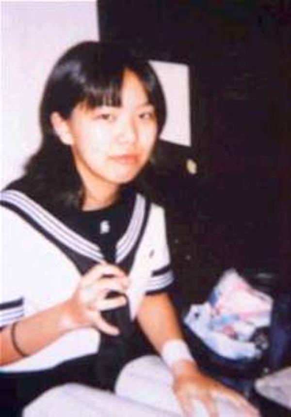

# 南条彩

> **声明**  
> 该条目涉及现实中的人物，其影响具有一定争议，请理性看待。  
> 该条目中出现自杀、自残行为的描写，请勿模仿。

主角妹妹的名字叫做「あや（Aya）」，而爱丽丝的全名为「南条ありす」。这两个名字 neta 了一位日本心理健康系网络红人，**南条彩**。

## 个人介绍

**南条彩**（日语：南条 あや，罗马音：Nanjou Aya），生于 1980 年 8 月 13 日，于 1999 年 3 月 30 日去世。她出身东京都世田谷区，本名是**铃木纯**。

南条彩童年时父母离婚，有一段时间与母亲和再婚的继父生活，而后由亲生父亲抚养。小学时就遭到校园霸凌，曾长期不上学。为躲避小学同学的霸凌，就读于外地的私立初中，依然遭到霸凌。

初一开始割腕，一直持续至其暮年。高三时（1998 年 7 月 27 日至 1998 年 10 月 2 日）入院
大学附属医院精神科的封闭病房。

高三时向医疗撰稿人**町田あかね**（町田茜）的网站「町田あかねのおクスリ研究所（町田茜的药物研究所）」上就「征集关于精神病和精神药物的体验谈募集」发送了电子邮件。因其写作才能受到赞赏，自 1998 年 5 月 28 日至 1999 年 3 月 17 日，每日都在网站上发布日记。

在自己的日记中透露了自己抑郁症相关的内容，获得了大量支持，尤其是情况类似的年轻人，并成立了粉丝俱乐部。为压制割腕的冲动，常去献血。

南条彩在高中毕业典礼结束后的第 20 天（1999 年 3 月  30 日）正午左右，独自一人前往一家卡拉 OK，并在此后的 3 小时内服用了大量精神药物，于昏睡状态被送入病院，经抢救无效死亡，年仅 18 岁。司法解剖的结果显示其服用的大量精神药物并未达到致死量，而是因其日常割腕与献血，生前有慢性贫血，另外也发现了心脏瓣膜上的穿孔。死因为「推定自杀」。[^1][^2]

## 相关作品

南条彩在网络上拥有一定的影响，除去她自己作为网络作家写的作品，也有很多以她的经历改编、取材、致敬的作品。

### 南条彩个人作品

- 日记集《卒業式まで死にません―女子高生南条あやの日記》[^3]
- 诗歌《終止符》（收录于日记集中）

  
也可以在其个人网站「南条あやの保護室」[^4]（2008 年及以前可访问）中查看其作品。

### 致敬作品

- VOCALOID 歌曲《無法成為南条あや》[^5]

---

[^1]: [南条彩 - 维基百科，自由的百科全书](https://zh.wikipedia.org/wiki/%E5%8D%97%E6%9D%A1%E5%BD%A9)  
[^2]: [牢狱考据第一弹——南條あやになれなくて - 知乎](https://zhuanlan.zhihu.com/p/40542902)  
[^3]: [Amazon.co.jp: 卒業式まで死にません―女子高生南条あやの日記（新潮文庫）：あや, 南条：日本图书](https://www.amazon.co.jp/%E5%8D%92%E6%A5%AD%E5%BC%8F%E3%81%BE%E3%81%A7%E6%AD%BB%E3%81%AB%E3%81%BE%E3%81%9B%E3%82%93%E2%80%95%E5%A5%B3%E5%AD%90%E9%AB%98%E7%94%9F%E5%8D%97%E6%9D%A1%E3%81%82%E3%82%84%E3%81%AE%E6%97%A5%E8%A8%98-%E6%96%B0%E6%BD%AE%E6%96%87%E5%BA%AB-%E5%8D%97%E6%9D%A1-%E3%81%82%E3%82%84/dp/4101420211)  
[^4]: [南条あやの保護室―Wofficial Memorial Site―](https://web.archive.org/web/20030805035852/nanjouaya.com/hogoshitsu/memory/index.html)  
[^5]: [【初音ミク】無法成為南条あや【牢獄P】 \_哔哩哔哩\_bilibili](https://www.bilibili.com/video/BV1GW411v7ug)