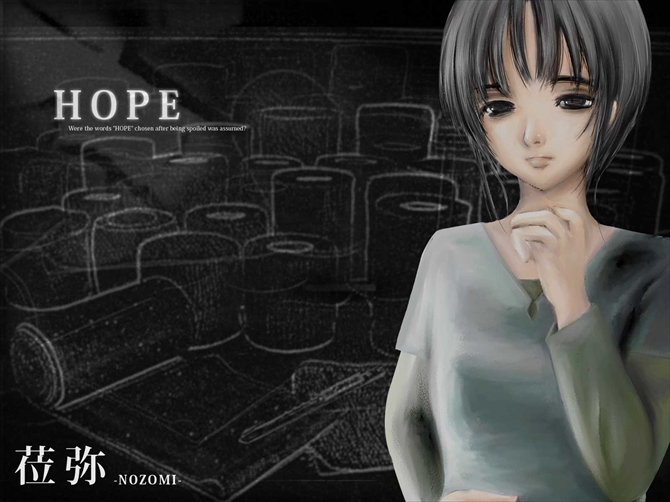
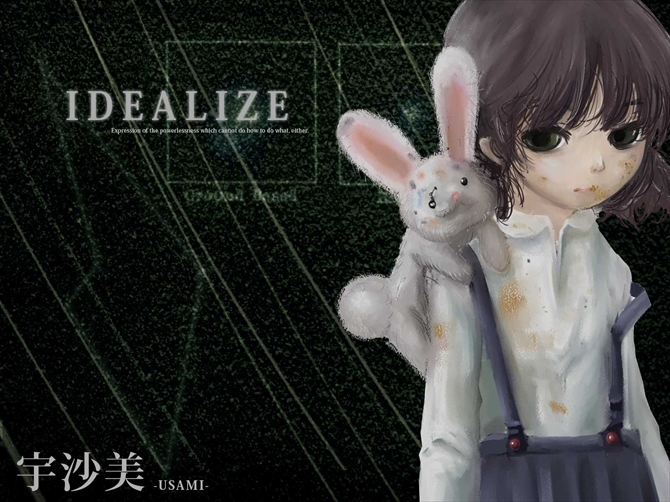

# 莅弥和宇沙美

## 莅弥

保健委员，拥有情绪不稳定型人格障碍（IDC10：F60.31）。会因为他罚和内罚进行自残和自慰。

### 他罚

**他罚**（日语：他罰的）是一种思维方式，会引起对引发事件的事件或人的怨恨。与他责不同，他责是客观看待事物的方式，他罚则是主观性地对他人或事物产生怨恨。他罚常见于自恋型人格障碍。与他罚相对的是**内罚**（日语：内罰的），指在心理学中，当一个人失败或不按自己的方式行事时，将攻击转向自己并责备自己的倾向。

### 潘多拉魔盒

**潘多拉魔盒**（英文：Pandora's Box）即希腊神话中宙斯给潘多拉的神秘盒子，宙斯要求潘多拉不可以打开，但潘多拉不敌好奇心将其偷偷打开，向人间释放了各种邪恶──贪婪、虚伪、诽谤、嫉妒、痛苦、疾病、祸害等等。潘多拉急忙关上盒子，却关住了盒内仅剩的「希望」（希腊文为 Elpis，有说法指出 Elpis 并非希望，而是指「对坏事或好事的期望」）。[^1]

## 宇沙美

伙食委员，拥有童年离别焦虑障碍（IDC10：F93.0）。年龄最小的患者，妄想自己是被秘密派遣到地球拯救地球的外星人，把兔子玩偶当成所谓母星带过来的拟态万能通信机，可以用来和母亲通话。对宇沙美来说，兔子玩偶是母亲的代理，因为分离焦虑对其死死不放，总是带在身上。因为通信装置不防水而拒绝洗澡，所以有令人眩晕的体臭。

---

[^1]: [潘多拉的盒子 - 维基百科，自由的百科全书](https://zh.wikipedia.org/wiki/%E6%BD%98%E6%9C%B5%E6%8B%89%E7%9A%84%E7%9B%92%E5%AD%90)
