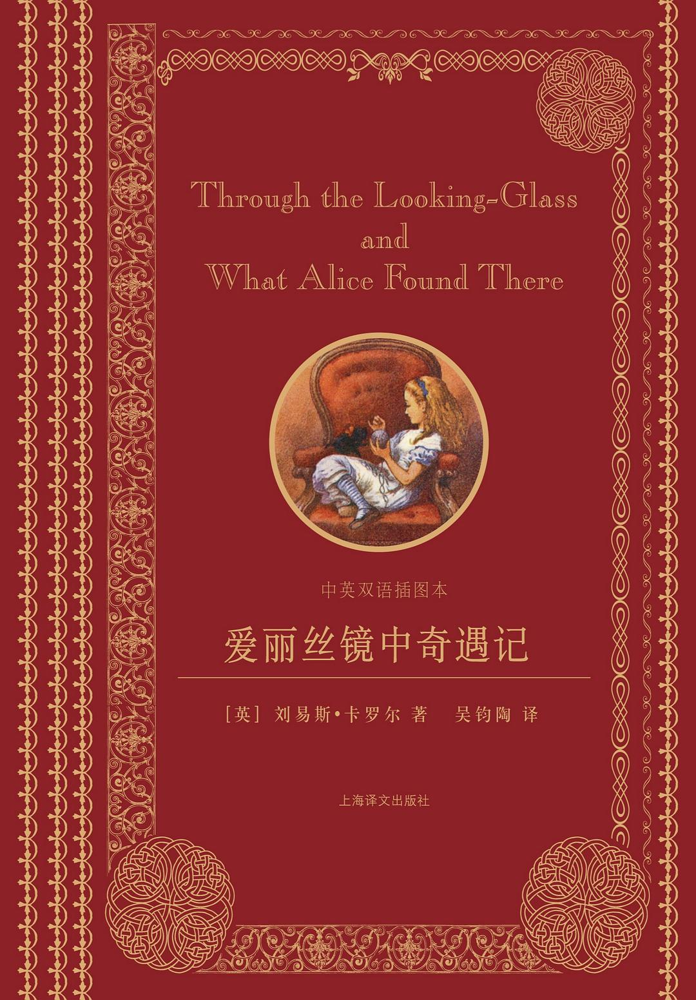
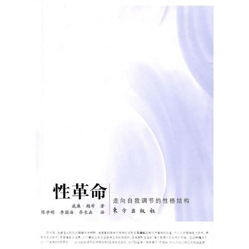
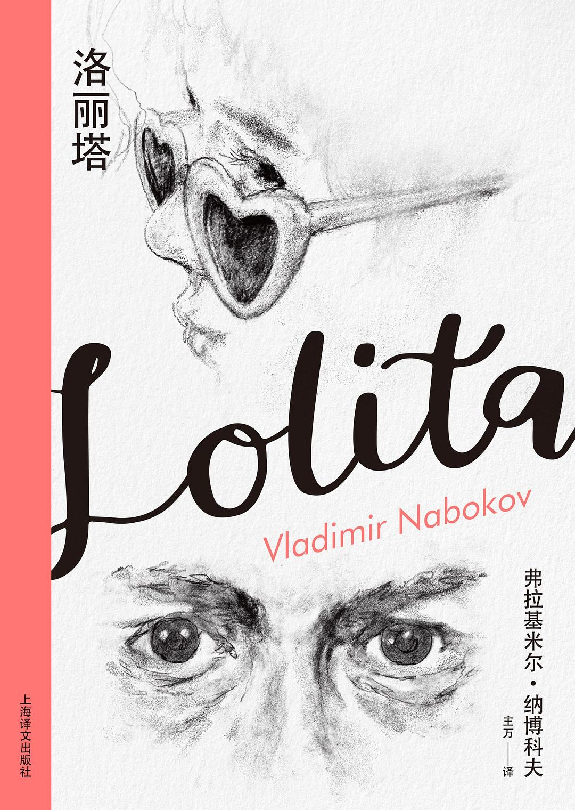
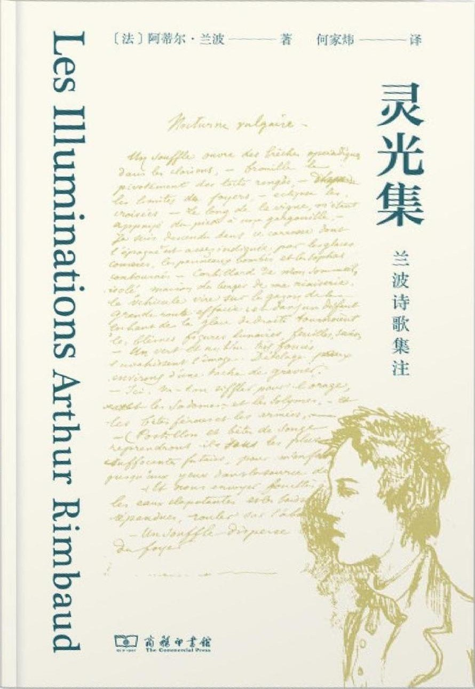
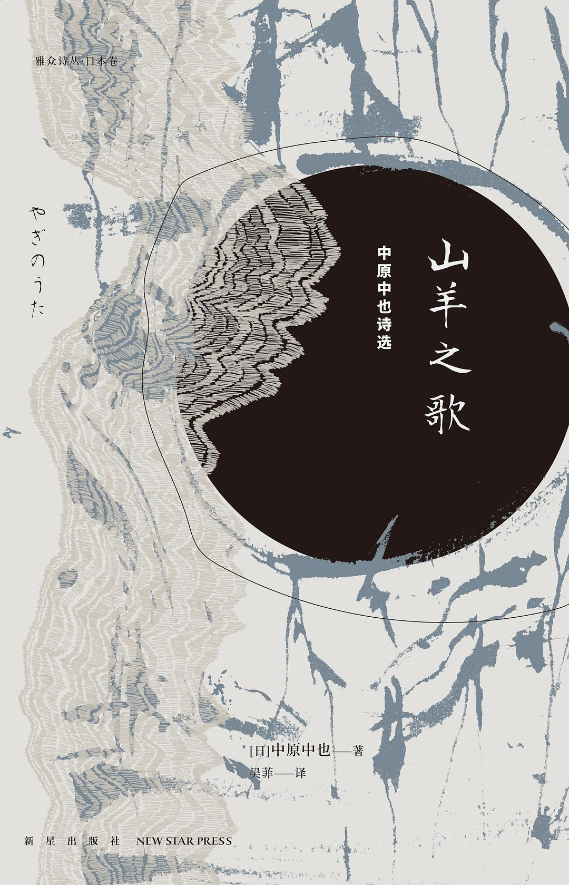
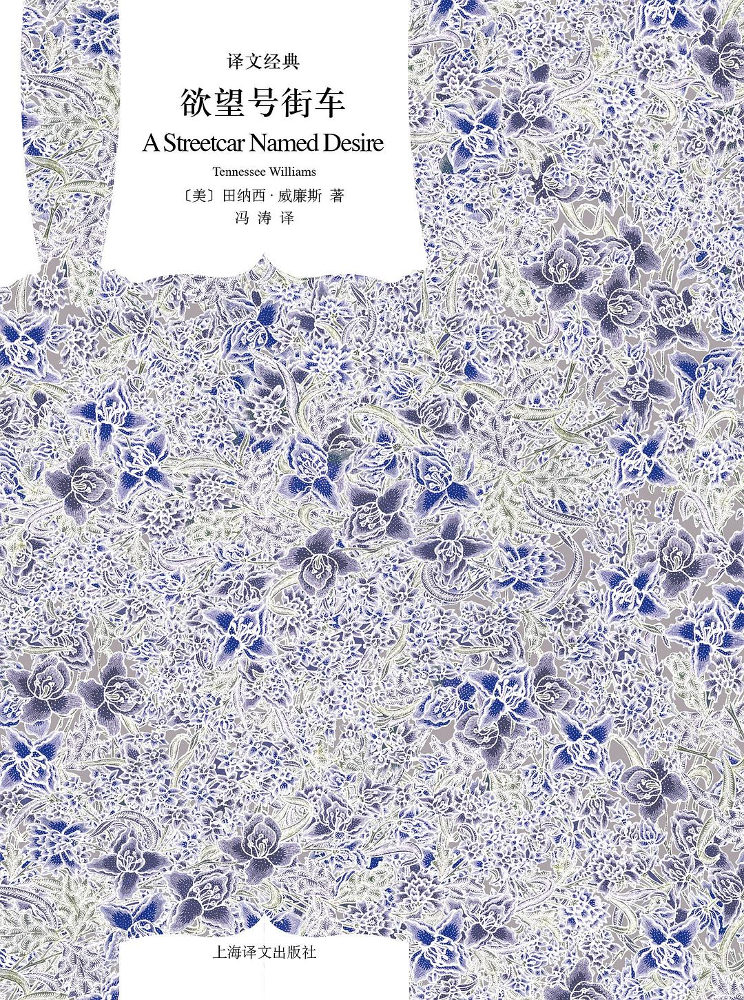
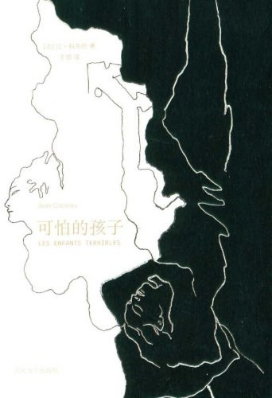
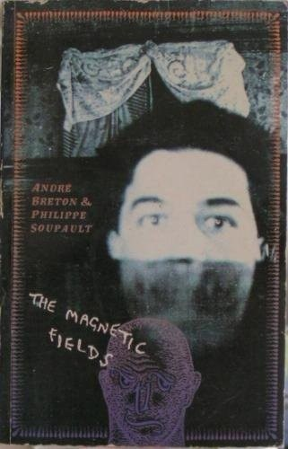
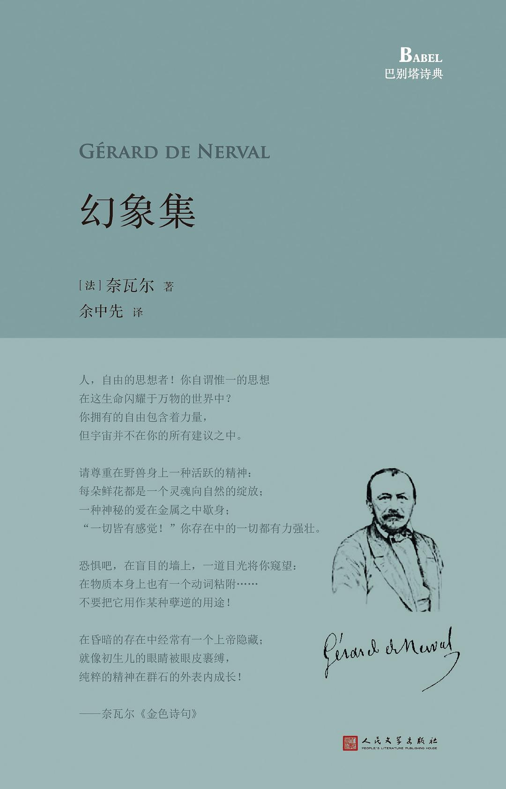

# 晶子

文艺委员，拥有轻度精神迟滞（IDC10：F70.0）。章子的双胞胎妹妹，实际年龄为十五至二十岁左右，因精神发育迟滞，心理年龄约为十岁左右。喜欢绘画、研究美术和文学理论，在绘画方面有一定的天分。外貌和章子完全一致而表现出的神态有所不同，可以通过行为区分二人。

## 书单

### 刘易斯·卡罗尔的《爱丽丝镜中奇遇》

*Through the Looking-Glass, and What Alice Found There*，即《爱丽丝镜中奇遇》，亦译作《镜中奇缘》。《镜之国的爱丽丝》（武陵人汉化组）从是日本的翻译『镜の国のアリス』直译过来的。本书是《爱丽丝梦游仙境》（*Alice's Adventures in Wonderland*）的续作。作品中有大量关于镜子的主题，像是对称、时间逆转等，同时包含了许多国际象棋的要素。本书维持前作《爱丽丝梦游仙境》中一贯的天马行空、奇想天外剧情，同样包含了大量令人拍案的双关语、谐音等语言游戏，以及多首恶搞当代著名童谣或诗歌的胡闹诗（nonsense verse），展现十足刘易斯·卡罗尔的独特奇幻文风。[^1]

### 威廉·赖希的《性革命》

*Die Sexualität im Kulturkampf*，武陵人汉化组译为《文化斗争中的性行为》，英译名为 *The Sexual Revolution*，中译版有《性革命》（东方出版社）。性革命一词是由威廉·赖希（Wilhelm Reich）在他的《性革命》一书中创造的。该书于 1936 年首次以德文出版，并被翻译成英文。英文版是 1945 年。赖希于 1957 年在狱中去世，但他的想法在 1960 年代产生了影响，使人们改变了对性的看法，比如对同性恋和自慰的态度有所改观。[^2]

### 弗拉基米尔·纳博科夫的《洛丽塔》

*Lolita*，是俄罗斯裔美国作家弗拉基米尔·纳博科夫用英语书写的成名小说。小说于 1955 年在法国巴黎出版，1958 年在纽约出版，1959 年在伦敦出版，之后小说由作者翻译为俄语。[^3]《洛丽塔》是二十世纪文坛最有名的作品之一，也因其剧情中一些关于恋童的描写成为最具争议的作品之一。

### 让·尼古拉·阿蒂尔·兰波的《灵光集》

*Les Illuminations*，中译《灵光集》或《彩画集》，是 19 世纪法国著名象征主义诗人、超现实主义诗歌的鼻祖阿蒂尔·兰波的一组不完整的散文诗，部分发表在 1886 年 5 月至 6 月的巴黎文学评论《时尚》（*La Vogue*）上。1886 年 10 月，Les publications de La Vogue 以书籍形式重印了这些文本，标题为 *Les Illuminations*，由诗人保罗·韦尔伦（Paul Verlaine，兰波的前情人）提议。在序言中，韦尔伦解释说，这个标题是基于英文单词 illuminations，在彩色图版的意义上，以及兰波已经给作品起的副标题。[^4]

### 中原中也的《春日狂想》

『春日狂想』，日本诗人中原中也于 1937 年为在 1936 年，年仅两岁的长子因病夭折而写的诗歌。

### 田纳西·威廉斯的《欲望号街车》

*A Streetcar Named Desire*，美国剧作家田纳西·威廉斯 1947 年所作剧本，1948 年获普利兹戏剧奖。《欲望号街车》常被认为是 20 世纪最好的剧本之一，许多人也认为它是田纳西·威廉斯最伟大的一部作品。[^5]

### 让·科克多的《可怕的孩子》

*Les Enfants terribles*，是让·谷克多（Jean Cocteau）于 1929 年创作的自传体小说，讲述一对姐弟的非正常生活。他们之间进行着外人看起来过分的游戏，但对于他们来说又是必要的。在新人走进他们的生活之后，嫉妒和欺骗产生了。于 1950 年被拍成同名电影。[^6]

### 苏波的《磁场》

*Les Champs magnétiques*，是活跃于达达主义运动，共同创立了超现实主义运动的菲利普·苏波（Philippe Soupault，武陵人汉化组：苏泊尔特）和布勒东合着自动书写的第一本作品。[^7]

### 奈瓦尔的《幻象集》

*Les Illuminés, ou Les Précurseurs du Socialisme*，武陵人汉化组译为《幻视者》，中译名常采用《幻象集》，是法国诗人、作家热拉尔·德·奈瓦尔（Gérard de Nerval）于 1852 年出版的叙事或散文集。

## 研究

### 皮尔士符号学

皮尔士符号学（日语：記号論，英文：Semiotic theory of Charles Sanders Peirce，武陵人汉化组：符号论），記号論在日语中特指的即是查尔斯·桑德斯·皮尔士的符号学理论。相比于索绪尔的符号学中的二元传统（即能指、所指），皮尔士的符号学是三元的：像似符号（英文：Icon）、指示符号（英文：Index）、规约符号（英文：Symbol）。[^8]

### 意义论

意义论（日语：意味論）即语义学。语义学（英文：semantics），也作「语意学」，是一个涉及语言学、逻辑学、计算机科学、自然语言处理、认知科学、心理学等诸多领域的一个术语，其主要研究语义（英文：semanteme）和语意（英文：meaning）。

### 先锋派

先锋派（法语：avant-garde）是指在艺术、文化或社会方面具有实验性、激进性或非正统的人或作品，常常以作品的审美创新和初期难以被社会大众接受为特征。[^9]

---

[^1]: [爱丽丝镜中奇遇 - 维基百科，自由的百科全书](https://zh.wikipedia.org/wiki/%E6%84%9B%E9%BA%97%E7%B5%B2%E9%8F%A1%E4%B8%AD%E5%A5%87%E9%81%87)  
[^2]: [The Sexual Revolution - Simple English Wikipedia, the free encyclopedia](https://simple.wikipedia.org/wiki/The_Sexual_Revolution)  
[^3]: [洛丽塔 - 维基百科，自由的百科全书](https://zh.wikipedia.org/wiki/%E7%BD%97%E8%8E%89%E5%A1%94)  
[^4]: [Illuminations (poetry collection) - Wikipedia](https://en.wikipedia.org/wiki/Illuminations_(poetry_collection))  
[^5]: [欲望号街车 - 维基百科，自由的百科全书](https://zh.wikipedia.org/wiki/%E6%AC%B2%E6%9C%9B%E5%8F%B7%E8%A1%97%E8%BD%A6)  
[^6]: [可怕的孩子们 (豆瓣)](https://movie.douban.com/subject/1302072/)
[^7]: [菲利普·苏波 - 维基百科，自由的百科全书](https://zh.wikipedia.org/wiki/%E8%8F%B2%E5%88%A9%E6%99%AE%C2%B7%E8%98%87%E6%B3%A2)  
[^8]: [皮尔士符号学理论 - 维基百科，自由的百科全书](https://zh.wikipedia.org/zh-cn/%E7%9A%AE%E7%88%BE%E5%A3%AB%E7%AC%A6%E8%99%9F%E5%AD%B8%E7%90%86%E8%AB%96)  
[^9]: [先锋派 - 维基百科，自由的百科全书](https://zh.wikipedia.org/wiki/%E5%89%8D%E8%A1%9B)
