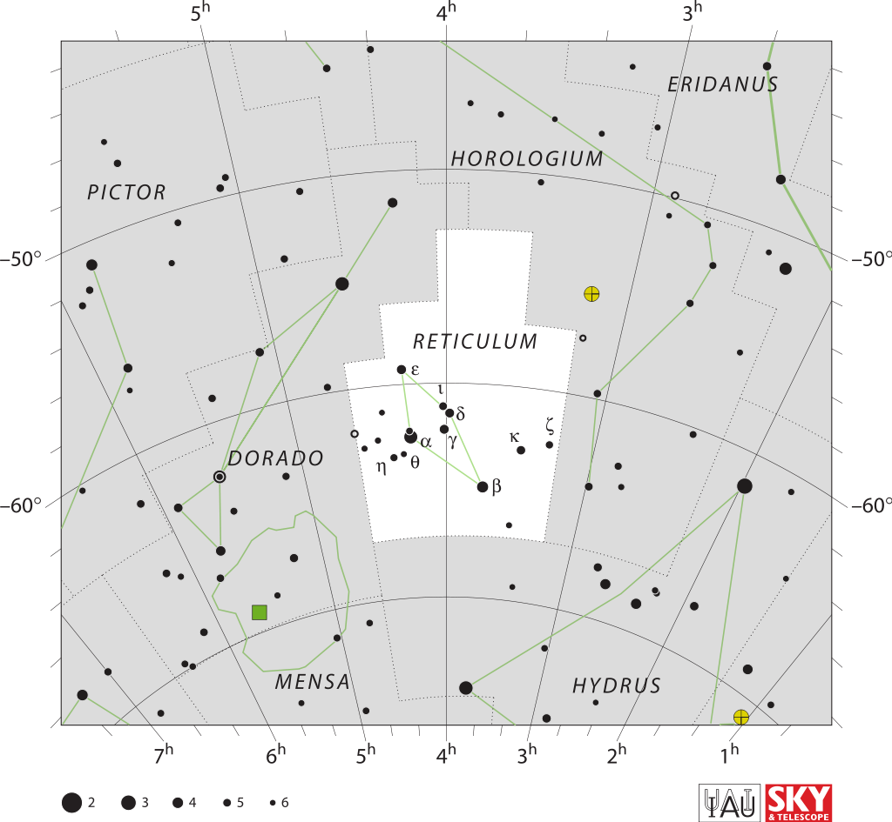

# 网罟座

**网罟座**（Reticulum）是法国天文学家拉卡伊创造的一个星座，其名称是拉卡伊为了纪念在目镜上加上精密观测用的网（十字丝）。网罟座是一个很小的远南天星座，其最突出的特点是几个有趣的双星和相对明亮的星系。最佳观测时间为 10 月至 12 月，同时，北纬 30 度以北地区只能在理想条件下观测到其一颗主星。[^1]

---

[^1]: [网罟座 - 维基百科，自由的百科全书](https://zh.wikipedia.org/wiki/%E7%BD%91%E7%BD%9F%E5%BA%A7)
