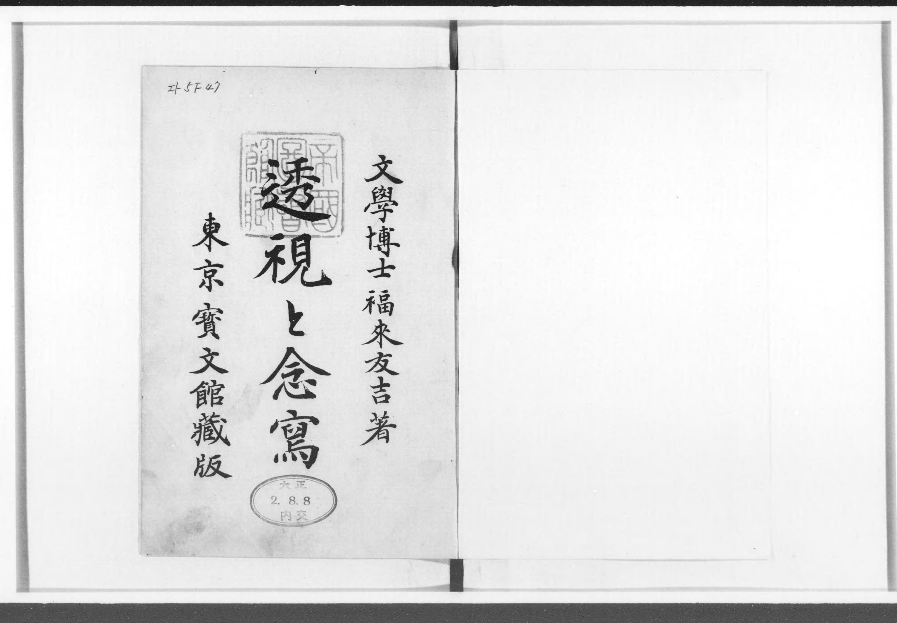

# 福来友吉的《透视与念写》

《透视与念写》（英文：*Clairvoyance & Thoughtography*），是福来友吉的一本心理学著作。**透视**与**念写**都属于超心理学中的超感官知觉。

书中讨论了**透视**（Clairvoyance）如何让人不受身体感官的限制来感知事件和信息，以及通过**念写**（Thoughtography）以让人在不使用相机的情况下，就能用胶片记录图像和思想。书中详细记录了一些人对此进行的实验，并配一百多张插图。

---

您可以点击上方图片或前往[日本国立图书馆](https://dl.ndl.go.jp/pid/951182/1/1)在线阅读。
