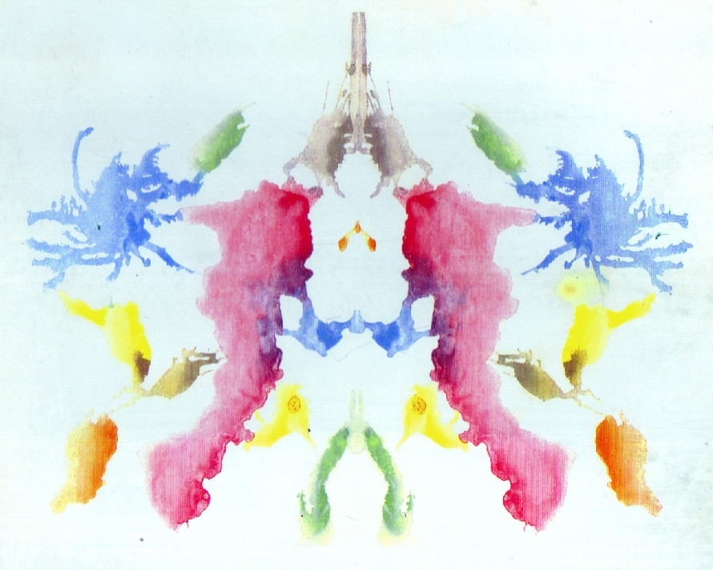

# 毒虫

## 罗夏测试

罗夏测试，或墨迹测试，由瑞士心理学家赫尔曼·罗夏于 1921 年创造。罗夏一开始将其用于诊断精神分裂障碍，后常被用作人格的投射测试。

> 罗夏测试中的其中一种墨迹，彩色

测验一共有 10 种墨迹卡片，其中 5 张是白底黑墨水，2 张是白底及黑色或红色的墨水，另外 3 张则是彩色的。[^1]

受试者会根据展示出的墨迹卡片进行自由联想，这些墨迹有着双边对称性。在完成了所有墨迹之后，受试者会要求再次阅读墨迹，并被要求注意为何会看到这些内容（自由联想），通常会被允许拿起卡片。

## 斑蝥与虎甲虫

**斑蝥**，又可写作**斑蟊**。中文世界中，斑蝥所指称的生物一直有所混淆，有的人用于指称虎甲虫，有的用于芫菁科，由于芫菁含有药性成分——斑蝥素（芫菁素），故中药里头的斑蝥无疑是指芫菁。但在日本，斑蝥被拿来指称虎甲虫，该名词可见于 1936 年，三轮勇四郎所著的《日本动物分类‧斑蝥科》，以及 1938 年三轮勇四郎的《日本甲虫分类学》等书。[^2]

マメハンミョウ（豆斑猫） 科：Meloidae （芫菁科）

ハンミョウ（斑猫、斑蝥） 科：Carabidae 属：Cicindela （Cicindelinae 科昆虫的总称） （虎甲虫）

## 柏拉图式的正义

柏拉图式的正义为理智、勇敢和节制三种德性所建构。 在柏拉图看来，无论是在国家统治者那里，还是在个人灵魂中，如果理智或理性占主导地位，其他两种德性赞助理智德性，则这个国家就是正义的，个人灵魂是正义的。[^3]

## 费马大定理

1637 年，费马在阅读丢番图《算术》拉丁文译本时，曾在第 11 卷第 8 命题旁写道：

> 将一个立方数分成两个立方数之和，或一个四次幂分成两个四次幂之和，或者一般地将一个高于二次的幂分成两个同次幂之和，这是不可能的。关于此，我确信我发现一种美妙的证法，可惜这里的空白处太小，写不下。

1995 年，安德鲁·怀尔斯和理查·泰勒在一特例范围内证明谷山志村猜想，弗赖的椭圆曲线刚好在这一特例范围内，从而证明费马大定理。[^4]

---

[^1]: [墨迹测验 - 维基百科，自由的百科全书](https://zh.wikipedia.org/wiki/%E5%A2%A8%E8%BF%B9%E6%B5%8B%E9%AA%8C)
[^2]: [斑蝥 - 维基百科，自由的百科全书](https://zh.wikipedia.org/wiki/%E6%96%91%E8%9D%A5)
[^3]: [柏拉图《国家篇》中的正义与问题](http://www.shkxjk.com/CN/abstract/abstract5159.shtml)
[^4]: [费马大定理 - 维基百科，自由的百科全书](https://zh.wikipedia.org/wiki/%E8%B4%B9%E9%A9%AC%E5%A4%A7%E5%AE%9A%E7%90%86)
