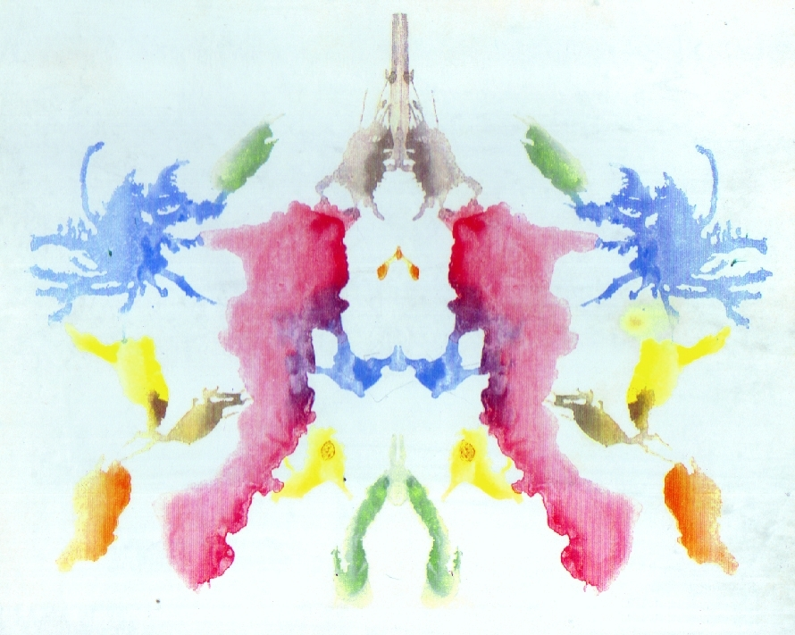

# 罗夏测试

罗夏测试，或墨迹测试，由瑞士心理学家赫尔曼·罗夏于 1921 年创造。罗夏一开始将其用于诊断精神分裂障碍，后常被用作人格的投射测试。

> 罗夏测试中的其中一种墨迹，彩色

测验一共有 10 种墨迹卡片，其中 5 张是白底黑墨水，2 张是白底及黑色或红色的墨水，另外 3 张则是彩色的。[^1]

受试者会根据展示出的墨迹卡片进行自由联想，这些墨迹有着双边对称性。在完成了所有墨迹之后，受试者会要求再次阅读墨迹，并被要求注意为何会看到这些内容（自由联想），通常会被允许拿起卡片。

---

[^1]: [墨迹测验 - 维基百科，自由的百科全书](https://zh.wikipedia.org/wiki/%E5%A2%A8%E8%BF%B9%E6%B5%8B%E9%AA%8C)
