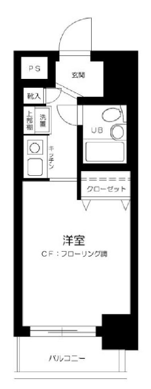

# 公寓压制

## 互联网停运日

此处或指代的是一作中速水发动的「网络恐怖行动」：

> 而正在双方交战的时候，研究所发动了网络恐怖行动。通过利用地下大量的光缆和卫星，向网络之中输送了远远超过其负荷的数据。造成了通信障碍。
>
> 同时，世界各地的服务器都被强制下线。通信障碍的起因是在东京湾的 16 重波 500Gbps 电缆，然后迅速扩散到了全世界，所有的主要通信回路都变得无法使用。
>
> 数分钟之后，网络恢复了正常，但是在这数分钟之内产生的损失是不可估计的。

## 1K

日本房屋户型，1K 为一个房间加一间厨房（Kitchen），之间有门隔断[^1]。

---

[^1]: 图纸出处：[【房产】日本的户型图怎么看？1R/1K/1LDK图纸都是什么样？-智钧日本房产投资](http://www.himawari-int.com/estate_news/1725)
