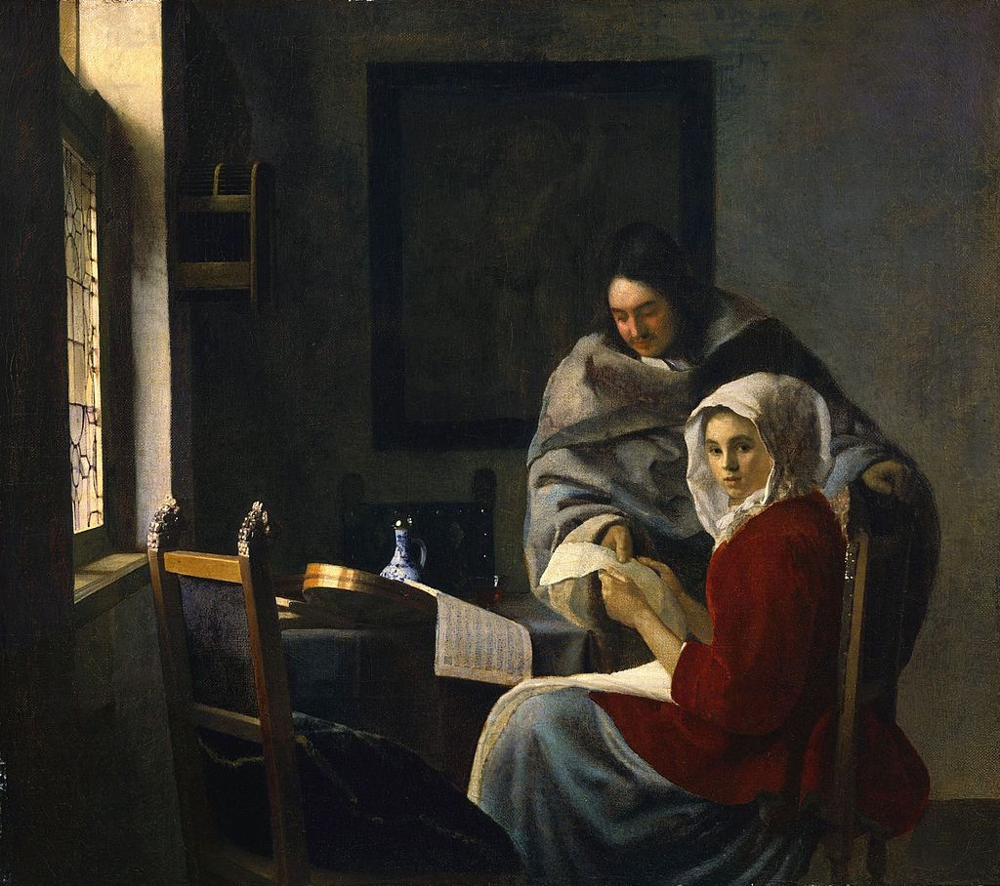

# 「中止奏乐的女孩」

**「中止奏乐的女孩」**（英文：*Girl Interrupted at Her Music*，荷兰语：*Onderbreking van de muziek*）是荷兰画家扬·维米尔的一副画作。它以巴洛克风格绘制，使用了布面油画，大约作成于 1658 至 1659 年。[^1]

《离开的人们 Ⅰ/Ⅱ 》的标题画面使用的便是经过滤镜处理的「中止奏乐的女孩」。

[^1]: [Girl Interrupted at Her Music - Wikipedia](https://en.wikipedia.org/wiki/Girl_Interrupted_at_Her_Music)
