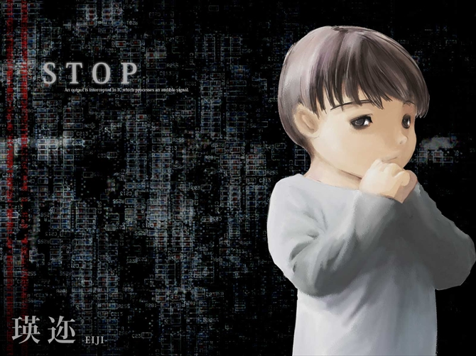
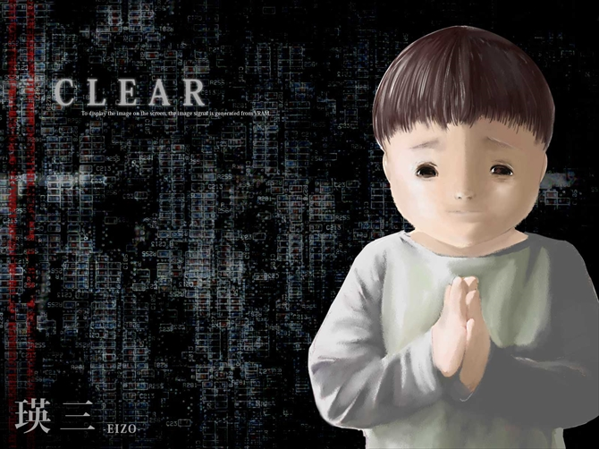

# 瑛迩和瑛三

## 瑛迩

观测委员，拥有混合型转换障碍（F44.7）。瑛迩是鹿南的孩子，瑛三的异卵双胞胎哥哥。妄想自己是计算机的接口，产生妄想的理由大约是姐弟的所属欲。他执着于听声音。

## 瑛三

联络委员，病症同上。瑛三是鹿南的孩子，瑛迩的异卵双胞胎弟弟。同样妄想自己是计算机的接口，理由同上。他执着于视觉情报。

### 前意识（Preconscious）

指无意识中可召回的部分，人们能够回忆起来的经验。它是无意识和意识之间的中介环节。无意识很难或根本不能进入意识，前意识则可能进入意识，所以从前意识到意识尽管有界限，但没有不可逾越的鸿沟。

瑛三在前意识中感到自我矛盾和不安。

### 行为化（）

[链接](https://sakurashinri.com/2022/12/03/%E3%82%AB%E3%82%A6%E3%83%B3%E3%82%BB%E3%83%AA%E3%83%B3%E3%82%B0%E3%83%BB%E5%BF%83%E7%90%86%E7%99%82%E6%B3%95%E3%81%AE%E5%9F%BA%E6%9C%AC%E3%80%80%E8%A1%8C%E5%8B%95%E5%8C%96%E3%81%AB%E3%81%A4%E3%81%84/)

[链接](https://en.wikipedia.org/wiki/Acting_out)
