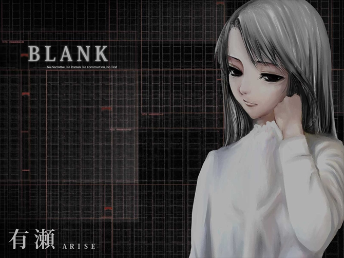

# 有濑

图书委员，拥有广泛性焦虑障碍（IDC10：F41.1）。有一头乌黑亮丽的长发，内心纠结矛盾，因此总是一脸忧伤。有濑沉迷于强迫性的防御行动，这点运用到了弗洛伊德提出的心理防卫机制，其中她最擅长的是**反作用形成**。

## 弗洛伊德心理防卫机制 [^1]

**弗洛伊德心理防卫机制**（英文：Defense Mechanism）指无意识的心理机制，其作用在于减少因不可接受或潜在有害的事物带来的焦虑。心理防卫机制可以按照心理成熟度分类，分为四级，也可以按照行为性质分类，在此主要讲一些常见的：

### 否认

**否认**（英文：Denial）即无意识地拒绝承认那些不愉快的现实以保护自我。它是最原始最简单的心理防卫机制。例：癌症病人否认自己患了癌症。

### 歪曲

**歪曲**（英文：Distortion）即将外界事实加以曲解、变化以符合内心的需要，属于精神病性的心理防卫机制。因歪曲作用而表现的精神病现象以妄想或幻觉最为常见。

**妄想**是将事实曲解，并且坚信不疑；**幻觉**是无外界刺激下脑子里凭空感觉到的声音、影像或触觉等反应，它与现实脱节，严重歪曲了现实。例：昨天才和女友分手，却以为要和女友结婚，甚至到处向亲朋好友发喜帖。

### 反作用形成

**反作用形成**（英文：Reaction Formation）或称**反向、矫枉过正**，指意识性地采取某种与潜意识所完全相反的看法和行动，因为真实意识表现出来不符合社会道德规范或引起内心焦虑，故朝相反的途径完全释放。例：有濑心中认为自己的小说十分有艺术价值，因此自认高人一等，并会指责批评自己小说的人，这些想法在她看来是不好的，所以又通过反向产生了对自己作品的负面想法，不愿意将自己的作品给别人看。

### 转移

**转移**（英文：Displacement）也称**移置**，是指将在一种情境下是危险的情感或行动转移到另一个较为安全的情境下释放出来。通常是把对强者的情绪、欲望转移到弱者身上。例：对上级的愤怒和不满情绪，在家对亲人发泄出来。由此引发的踢猫效应也相当常见。

### 压制／潜抑

**压制**（英文：Suppression）或**潜抑**（英文：Repression）指当一个人产生痛苦情绪或经历心理创伤时，有意识地控制自己，避免心理上触及创伤。**潜抑**指当一个人的某种观念、情感或冲动不能被超我接受时，下意识地将极度痛苦的经验或欲望潜抑到潜意识中去，以使个体不再因之而产生焦虑、痛苦，这是一种不自觉的主动性遗忘（不是否认事实），有时表现为口误笔误。

两者的差别在于，压制并非是潜意识的，而潜抑用到了潜意识。例：儿童幼年因火灾丧母后，会主观地避免看到火灾相关的报导或是日常中与火有关的行为，以此让自己不易想起幼年的痛苦，这属于压制；而如果是下意识地将火灾丧母的回忆抑制在潜意识中，便会在表面上遗忘这段回忆，无法想起自己母亲去世相关的事情。但是一旦接触到火或是火灾相关的内容，还是会产生痛苦的情感，这便是潜抑。

### 投射

**投射**（英文：Projection）也称**外向投射**。是主观地将属于自身的一些不良的思绪、动机、欲望、或情感，赋予到他人或他物身上，推卸责任或把自己的过错归咎于他人，从而得到一种解脱。例：自己撒谎成性，声称其他人也是在撒谎。

### 摄入

**摄入**（英文：Introjection）也称**内向投射**。指广泛地、毫无选择地吸收外界的事物，而将它们变成自己人格的一部分。由于摄入作用，有时候人们爱和恨的对象被象征地变成了自我的组成部分。例：由于失去了自己的亲人，会不自觉地模仿死者的性格特点。

### 仿同

**仿同**（英文：Identification）指一种无意识的，有选择性地吸收、模仿或顺从另外一个一般是自己敬爱和尊崇的人或团体的态度或行为的倾向，以对方之长归为已有，作为自己行为的一部分去表达，以此吸收他人的优点以增强自己的能力、安全感以及接纳等方面的感受，掩护自己的短处。

### 转化

**转化**（英文：Conversion），俗称**歇斯底里**，指将精神上的痛苦、焦虑转化为躯体症状表现出来，从而避开了心理焦虑和痛苦。

### 理智化

**理智化**（英文：Intellectualization），即为在情感上让自我脱离压力事件，理智化通常不透过接受现实，而经由用有利于自己的理由来为自己辨解，将面临的窘境加以文饰，以此合理化自己的行为或处境，隐瞒自己的真实动机或境遇。例：医生不带感情地面对医院中的生老病死以降低自己内心的焦虑。

### 升华

**升华**（英文：Sublimation），即被压抑的不符合社会规范的原始冲动或欲望另辟蹊径用符合社会认同的建设性方式表达出来，并得到本能性满足。这种行为一般对社会有利，从而会受到提倡和鼓励。

这种手段在《去人たちⅡ · 精神病十种》里很常见。比如有濑将自己的心理冲动运用在写作中，使用到了升华的防卫机制。伊津佳有反社会人格，她想要通过阻止坏事来发泄自己的破坏冲动，这也是一种升华。其他有用到「升华」的，还有鹿南等。

---

[^1]: [心理防卫机制 - 维基百科，自由的百科全书](https://zh.wikipedia.org/wiki/%E5%BF%83%E7%90%86%E9%98%B2%E5%8D%AB%E6%9C%BA%E5%88%B6)
