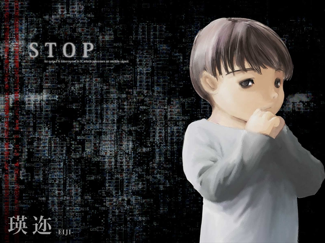
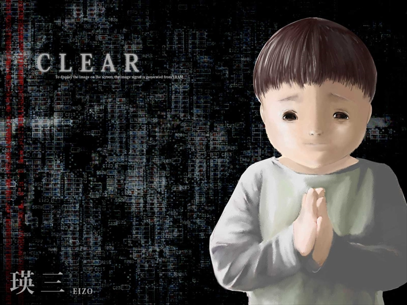

# 瑛迩和瑛三

## 瑛迩

观测委员，拥有混合型转换障碍（IDC10：F44.7）。瑛迩是鹿南的孩子，瑛三的异卵双胞胎哥哥。妄想自己是计算机的接口，产生妄想的理由大约是姐弟的所属欲。他执着于听声音。

## 瑛三

联络委员，病症同上。瑛三是鹿南的孩子，瑛迩的异卵双胞胎弟弟。同样妄想自己是计算机的接口，理由同上。他执着于视觉情报。

### 前意识

**前意识**（英文：Preconscious）指无意识中可召回的部分，人们能够回忆起来的经验。它是无意识和意识之间的中介环节。无意识很难或根本不能进入意识，前意识则可能进入意识，所以从前意识到意识尽管有界限，但没有不可逾越的鸿沟。

瑛三在前意识中感到自我矛盾和不安。

### 见诸行动

**见诸行动**（英文：Acting Out，武陵人汉化组：行为化）在弗洛伊德的精神分析理论中，被视作一种不成熟的防御机制，其行为通常被认为是反社会性的，具有冲动或爆发性质。通常指按冲动行事，而非接受或管理冲动（英文：Acting In）。
