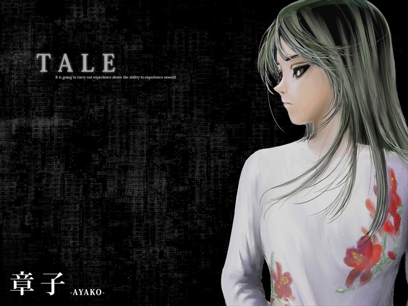

# 章子

风纪委员，非特定型人格障碍（ICD10：F60.9）。她是晶子的双胞胎姐姐，会将晶子当作自己的分身，而非自己的妹妹。

## 双胞胎的名字

原文提到「一看到两个人复杂的名字，就可以想到她们的父母是什么货色了。」可能指两个人的名字过于接近，同时「あやこ（Ayako）」的名字采用不常用的汉字「章子」（更常见的如「綾子」「彩子」「文子」等），「晶子」名字的读音却没有用「あきこ（Akiko）」而是更复杂的「あきらこ（Akirako）」。大约是批评她们的父母起名繁琐。

## 二重身

**二重身**（英文：Double Gengar，德语：Doppelgänger，自我幻视）都可以指现实生活中自己看见自己，或是同时存在另一个一模一样的自己。

## 镜映描写法

**镜映描写法**（英文：Mirror Drawing Test，MDT）是一种情绪压力负荷测试。被测试者对镜子之中映照出来的星形线进行临摹，当临摹出现错误的时候，便会出现断断续续的刺激音，根据临摹一周的时间来判断被测试者是正常还是异常。一般也有不会出现刺激音惩罚的 MDT。该测试可以用以判断被测试者的注意力等，目前基本只有日语文献对其有所介绍和研究。

## 章子对晶子的情结

一般来说，当双胞胎中的一方见到另一方以不同的方式被对待（优待），便会极力要求自己以完全相同的方式对待，如父母买玩具或衣服给其中一方时，另一方也会想要完全相同的玩具或衣服。虽然这种情结并没有什么研究或数据证实，但章子对于晶子的情结很有可能与此类似。
