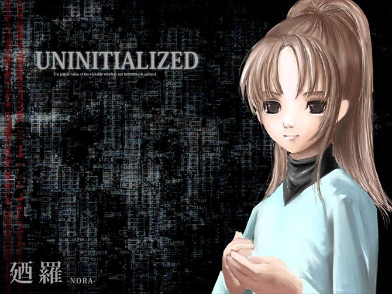
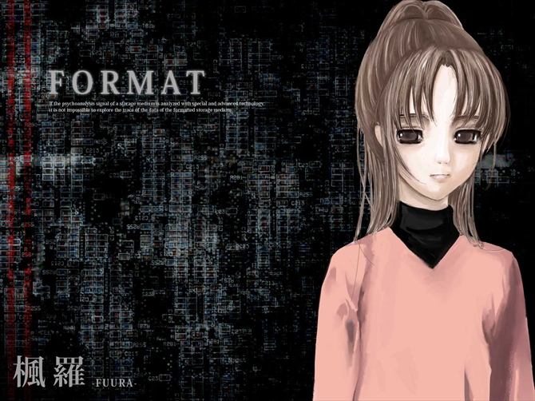

# 迺罗和枫罗

## 迺罗

饲育委员，病症同鹿南，也是持久性妄想障碍（IDC10：F22.9）。迺罗是鹿南的孩子，十四岁，枫罗的同卵双胞胎姐姐，有一头长至肩膀，稍显栗色的黑发，梳马尾，马尾向左偏。妄想自己是储存器，表情冷淡。

迺罗会通过记日记的方法，将自己一天的行动详细记录下来，将鹿南要求的事情简略记录下来。

### 分页法 / 内存分页

虚拟内存技术中，**分页**（英文：Paging）是把整个虚拟和物理内存空间切成一段段固定尺寸的大小，能有效降低整体及额外非必要的 I/O 次数，提高系统整体运作性能。

### 全息存储技术

**全息存储技术**（英文：Holographic Data Storage）是一种利用激光全息摄影原理将图文等信息记录在感光介质上大容量信息存储技术。传统的磁存储和光学存储技术将每一个比特都记为介质表面磁或光的变化，而全息存储将信息记录在介质的体积内，而且利用不同角度的光线可以在同样的区域内记录多个信息图像。另外，磁存储和光存储每次都只能读写一个比特的信息，而全息存储可以并行的读写数百万比特，这样可以使信号的传输速率大大超过目前光存储的速度。[^1]

迺罗使用的全息存储技术，大概是将人类本身存储记忆的方法当作一种全息存储技术，而并非是利用激光全息摄影原理的全息存储技术。

### 内容可寻址内存

**内容可寻址内存**（英文：Content-Addressable Memory，CAM，武陵人汉化组：联想储存器）是一种特殊类型的存储器，用于某些超高速搜索应用程序。它也称为关联内存或关联存储，将输入搜索数据与存储数据表进行比较，并返回匹配数据的地址。[^2]

迺罗将海马和大脑边缘系之中与空间印象有关的区域割让了一半出来，作为内容可寻址领域。

### 面向比特的语言

> 脳の可塑性がなし得た技であったのだろうが、思考するための言語つまり内言語に日本語を用いることを止めそのビットオリエンティッドとでもいうべき言語を廼羅は使うようになった。

**面向比特的语言**（日语：ビットオリエンティッド，面向比特的，武陵人汉化组：按位存取），大意是以二进制作为自己的语言，此处可理解为按位存取。**按位存取**（英文：Bitwise Access），即直接对二进制位进行读取和写入。

### 内语言

**内语言**（英文：Internalized Language）即美国语言学家、哲学家诺姆·乔姆斯基（Avram Noam Chomsky）提出的内化语言，与外化语言相对。外化语言指语言行为的产物，与大脑的属性无关。外化语言即是传统语法的研究对象，而传统语法是是人们为了交流而掌握并使用的一套规则。

内化语言彻底抛弃了社会性、规则和语法结构的概念，关注的是人的内在属性。内化语言是存在人脑之中「对结构的概念」。它能使人造出他自己的句子，它能使说话者说出并听懂那些无论自己或对方以前都没有听过的，甚至在那个语言的历史上也未曾有过的「随意的语言」。[^3]

迺罗将「按位存取」作为自己的内化语言，这使她可以直接说出和记忆整数的二进制的位。

## 枫罗

饲育委员，病症同鹿南，也是持久性妄想障碍（IDC10：F22.9）。枫罗是鹿南的孩子，迺罗的同卵双胞胎妹妹，十四岁。外表和迺罗几乎完全一致，只有马尾向右偏。妄想自己是大容量记忆装置，面部表情丰富。

可以将鹿南看作中央处理器，迺罗看作内存，枫罗则是硬盘（外存）。她和鹿南之间的联系没有鹿南和迺罗之间的紧密。

---

[^1]: [全息存储 - 维基百科，自由的百科全书](https://zh.wikipedia.org/wiki/%E5%85%A8%E6%81%AF%E5%AD%98%E5%82%A8)
[^2]: [内容可寻址内存 - 维基百科，自由的百科全书](https://zh.wikipedia.org/wiki/%E5%86%85%E5%AE%B9%E5%8F%AF%E5%AF%BB%E5%9D%80%E5%86%85%E5%AD%98)
[^3]: 覃俐俐.乔姆斯基的“内化语言”观[J].长春师范学院学报, 2012.DOI:CNKI:SUN:CCSS.0.2012-05-019.
