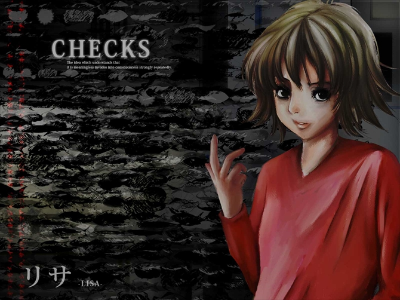
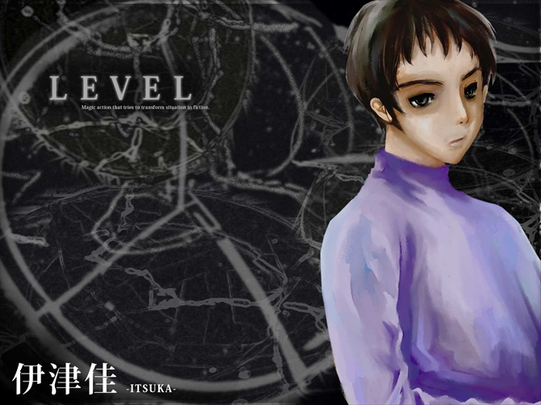

# 莉莎和伊津佳

## 莉莎

伙食委员，拥有强迫型行为疾患（F42.1）。她负责制作全部的料理。

### 睡眠-觉醒周期（sleep-wake cycle）

即睡眠与觉醒状态交替出现的周期。一般的睡眠-觉醒周期为24小时。克莱特曼（Nathaniel Kleitman）曾经在封闭、黑暗的洞穴中测试过是否可以将睡眠-觉醒周期调整至28小时，虽然时龄43岁的他在32天的实验中并没有成功，但他的学生理查德当时23岁，在开始实验的一周内就成功调整至28小时，验证了其具有一定可行性。

而这里提及的精神病人，居住在地下的封闭空间中，他们的睡眠-觉醒周期为48小时，睡14小时，醒34小时，也是可行的。

## 伊津佳

保安委员，拥有社会病态性人格障碍（F60.2）。她怀有破坏冲动，会通过寻找可以阻止的坏事，砸碎盘子，殴打自己等方式发泄。

