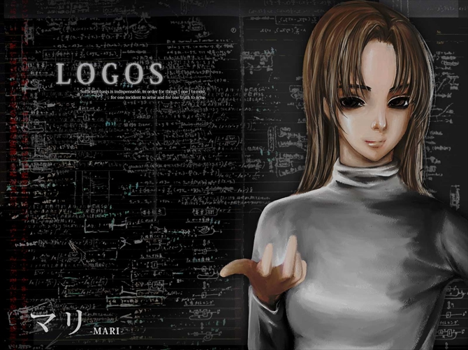

# 麻理

扫除委员，拥有神经衰弱（F48.0）。麻理精读医学书，了解病理知识，是患者中的领导者，拥有大家的信任。

## 自生思考（Forced Thinking）

即强制性思维，精神分裂症（思觉失调症）的一种症状。表现为自发的想法（杂乱无章的想法一个接一个地出现，它们变得杂乱无章。 想法自然而然产生。联想相互关联）、自体视觉（清晰的视觉图像自发地浮现在脑海中）、自体记忆回忆（被遗忘的琐碎经历被一个接一个地回忆起来）、自体内在言语（脑海中经常浮现出清晰的话语）等，使人感到「无法集中注意力」和「不安」。
